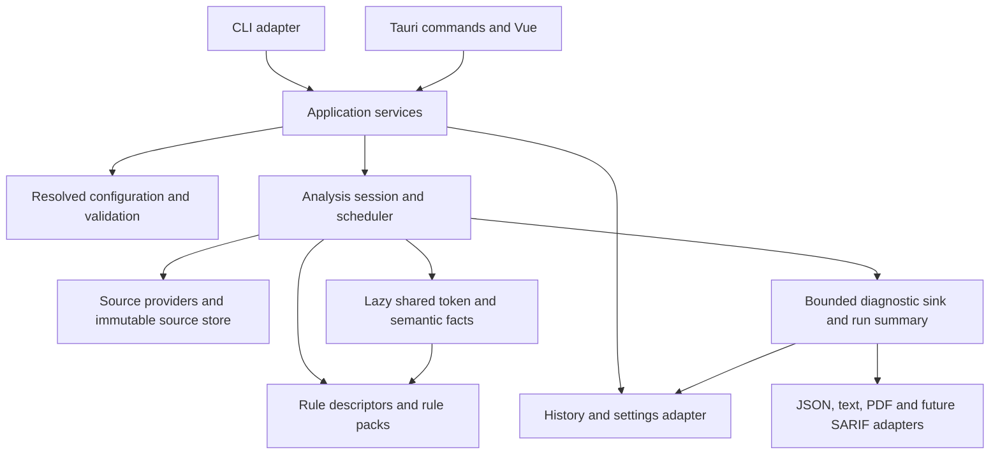

# Performance, Modularity, and Security Analysis Roadmap

**Project:** `gx-linter-rs`  
**Review date:** 2026-10-05  
**Reviewed revision:** `fb22874`  
**Status:** proposed; analysis and implementation plan only  
**Relationship to the delivery backlog:** follow-up to `backlog-engine-cli-tauri.json`, based on the implemented CLI and Tauri application.

## 1. Engineering assessment

The workspace has a useful foundation: separate engine, rules, storage, reporting, CLI, and desktop entry points; a shared analysis DTO; deterministic dispatch; per-object rule reset; explicit file failures; and a regression corpus. Preserve these assets and evolve the implementation in small, measurable increments.

The main scaling risks are source duplication, repeated parsing and registry construction, unrestricted aggregate memory consumption, incomplete cancellation, and moving entire results through IPC. The main architectural limitation is a rule API organized exclusively around individual lines. Adding AST, control-flow, or vulnerability rules directly to that API would make each rule reconstruct its own semantic model and multiply CPU and memory costs.

Correctness is a prerequisite for optimization. The review also reproduced false-success cases and source preprocessing defects. Address them before declaring a run complete or extending the product's security claims.

### Evidence and validation boundaries

- `cargo test --workspace --quiet`: **93 tests passed** in the current checkout.
- `npm run build` in `desktop/`: type checking and production build passed; emitted application JavaScript was approximately **106.36 kB**, or **39.15 kB gzip**. Bundle size alone does not measure scan or rendering latency.
- `cargo test --manifest-path desktop/src-tauri/Cargo.toml --quiet`: **7 desktop command tests passed**. These are backend contract checks, not UI latency measurements.
- Additional CLI probes reproduced an unknown-rule scan returning PASS, a source-free directory returning PASS with zero scanned files, a percentage threshold of 101 being accepted, and a quoted comment marker changing emitted source text.
- A `GX.2.5` probe using `where CustomerName = 'Admin'` emitted no finding. Inspect and explicitly adjudicate this behavior because the current sanitizer removes the literal before the rule examines it.
- The analysis inspected engine execution, dispatch, source extraction, the rule contract and representative stateful rules, persistence, CLI configuration, desktop commands, Vue stores and result/source views, manifests, and CI.
- No representative performance benchmark or allocation profile exists in the reviewed source. Timing and memory improvements below are objectives, not measured outcomes. Functional tests do not establish throughput, peak memory, cancellation latency, or vulnerability coverage.
- Native installer execution, visual desktop responsiveness, and release benchmarking were not validated in this review. The verification log at the end records the separate desktop command-test result.

## 2. Critical findings and source evidence

| ID | Priority | Observed implementation | Engineering consequence |
|---|---|---|---|
| F01 | P0 | The shared engine does not validate schema, rule IDs, or quality-gate bounds. CLI `effective_rules` accepts unknown IDs; desktop validation is a different path. | A malformed request can produce a misleading success; future integrations inherit inconsistent behavior. |
| F02 | P0 | Discovery discards `WalkDir` errors; an empty discovery result passes. Inputs are appended without canonical deduplication. Discovery excludes `.zip` and `.rar`, although extraction supports both and the file picker advertises them. | Incomplete coverage can appear complete; overlapping roots repeat work and findings; supported input behavior differs by entry point. |
| F03 | P0 | `blank_multiline_block_comments` applies a regex to whole source without respecting strings and removes text before diagnostic construction. `GX.2.5` scans text whose literals were removed. | Source evidence is altered and lexical context is lost. This is unsafe groundwork for vulnerability analysis. |
| F04 | P0 | XML code sections are joined with synthetic blank lines and only the first `code_start_line` is retained. Later sections use a single arithmetic offset in the viewer. | Findings after section boundaries cannot reliably map to physical member coordinates. Semantic rules would inherit ambiguous locations. |
| F05 | P1 | `ParsedLine` owns `source.content`, `raw`, `content`, `stripped`, `lower`, `clean`, `clean_lower`, and `clean_no_comments`, including exact duplicate strings. Dispatch allocates a selection vector and a candidate vector per line. | Repeated allocation and memory traffic in the hottest loop; total cost grows with lines and enabled rules. |
| F06 | P1 | Every file constructs all 30 rule instances before filtering and rebuilds dispatch. Most stateful rules observe every nonempty line. Metadata queries also instantiate rules. | Setup cost repeats for small files; growing the catalog increases work even for disabled rules. |
| F07 | P0 | Text/XML reads are unbounded. Archive headers have member/total limits, but runtime processing lacks a global budget, line/object/finding limits, and a deadline. All extracted objects are retained before linting. | Per-archive limits do not bound total process memory; multiple workers and diagnostic-heavy inputs can exceed practical memory limits. |
| F08 | P0 | Rayon parallelism is by top-level file. Cancellation is checked only before starting a file. Desktop scans share one atomic flag, reset by each invocation. | One large package remains sequential and cannot stop promptly; overlapping scans can interfere with cancellation. |
| F09 | P1 | Desktop returns all findings in one `AnalysisResult`; summary/PDF commands receive that result again. The source viewer re-extracts the entire artifact for each selection. | IPC and repeated decompression scale with total findings and package size, rather than the requested page or object. |
| F10 | P1 | Each progress event spreads the entire progress map. Counts scan all entries. Results use deep `ref`; filtering visits every finding; the source viewer renders every line. | Progress updates can accumulate quadratic work. Pagination bounds table DOM rows but does not bound payload, filtering, or source-view DOM work. |
| F11 | P1 | Each desktop DB operation calls initialization, migrations, seeding and validation. Issue insertion executes SQL inside a loop without an explicitly reused prepared statement; history fetches all issues. | Avoidable database setup and query costs; large histories need bounded queries and retention. Persistence failure can discard the already computed result at the adapter boundary. |
| F12 | P1 | `gx_engine` depends on `gx_storage` and `rusqlite`; `gx_core` includes file walking, ZIP/RAR and native linking; the rule trait knows only line evaluation. | Module names imply stronger boundaries than the dependency graph provides. Semantic analyses would easily accumulate duplicated parsing and adapter coupling. |
| F13 | P1 | Rust DTOs are manually mirrored in TypeScript. `Issue` has no range, category, confidence, rule version, CWE, or evidence path. History does not expose scan failures/full request and the UI hardcodes one scanned file. | Contract drift and loss of audit provenance; policy warnings cannot yet be distinguished reliably from security findings. |
| F14 | P1 | Cargo lockfiles are ignored, toolchain is floating `stable`, CI pushes target `main` while the reviewed branch is `master`, and the desktop declares Rust 1.77 while using `std::sync::LazyLock` through shared crates. | Reproducibility and declared compatibility are not established; dependency changes can affect performance without source changes. |

### Primary source anchors

- Engine lifecycle, extraction and timing: [runtime.rs:58](D:/dev/osobobo/gx-linter-rs/crates/gx_engine/src/runtime.rs:58). The existing elapsed measurement starts **after extraction**, so it excludes a potentially large part of total scan cost.
- Discovery, aggregation and validation boundary: [runtime.rs:195](D:/dev/osobobo/gx-linter-rs/crates/gx_engine/src/runtime.rs:195), [filesystem.rs:10](D:/dev/osobobo/gx-linter-rs/crates/gx_core/src/filesystem.rs:10).
- Per-file construction and cancellation: [runtime.rs:308](D:/dev/osobobo/gx-linter-rs/crates/gx_engine/src/runtime.rs:308), [runtime.rs:349](D:/dev/osobobo/gx-linter-rs/crates/gx_engine/src/runtime.rs:349).
- String ownership and line allocation: [models.rs:240](D:/dev/osobobo/gx-linter-rs/crates/gx_core/src/models.rs:240), [dispatch.rs:128](D:/dev/osobobo/gx-linter-rs/crates/gx_engine/src/dispatch.rs:128).
- Lexical masking and literal detection: [regex_cache.rs:34](D:/dev/osobobo/gx-linter-rs/crates/gx_core/src/regex_cache.rs:34), [rule_gx_2_5.rs:26](D:/dev/osobobo/gx-linter-rs/crates/gx_rules/src/rules/rule_gx_2_5.rs:26).
- Extraction, section concatenation and repeated newline counts: [xpz_extractor.rs:171](D:/dev/osobobo/gx-linter-rs/crates/gx_core/src/xpz_extractor.rs:171), [xpz_extractor.rs:420](D:/dev/osobobo/gx-linter-rs/crates/gx_core/src/xpz_extractor.rs:420), [xpz_extractor.rs:497](D:/dev/osobobo/gx-linter-rs/crates/gx_core/src/xpz_extractor.rs:497).
- Shared cancellation and full-package source access: [commands.rs:163](D:/dev/osobobo/gx-linter-rs/desktop/src-tauri/src/commands.rs:163), [commands.rs:393](D:/dev/osobobo/gx-linter-rs/desktop/src-tauri/src/commands.rs:393).
- Progress, result filtering and source rendering: [scan.ts:26](D:/dev/osobobo/gx-linter-rs/desktop/src/store/scan.ts:26), [FindingsTable.vue:25](D:/dev/osobobo/gx-linter-rs/desktop/src/components/FindingsTable.vue:25), [SourceViewer.vue:20](D:/dev/osobobo/gx-linter-rs/desktop/src/components/SourceViewer.vue:20).
- Database startup and insertion: [db.rs:47](D:/dev/osobobo/gx-linter-rs/crates/gx_storage/src/db.rs:47), [audit_dao.rs:137](D:/dev/osobobo/gx-linter-rs/crates/gx_storage/src/dao/audit_dao.rs:137).
- Line-only rule API and instance registry: [base.rs:77](D:/dev/osobobo/gx-linter-rs/crates/gx_rules/src/base.rs:77), [lib.rs:20](D:/dev/osobobo/gx-linter-rs/crates/gx_rules/src/lib.rs:20).

## 3. Target architecture

Use a modular in-process pipeline with explicit ownership and a bounded execution context. Keep the CLI and Tauri as adapters. Start with module boundaries inside existing crates; extract a new crate when the dependency boundary is useful and verified.

### Dependency boundaries

| Component | Owns | Must not depend on |
|---|---|---|
| Domain contracts | IDs, source spans, findings, rule metadata, request validation, summaries | SQLite, filesystem traversal, Tauri, PDF libraries |
| Source providers | Text/XML/ZIP/RAR decoding, sections, mapping, source-store access | Rule policies, quality gates, Vue |
| Analysis engine | Session lifecycle, scheduling, capability planning, budgets, shared facts | SQLite initialization, CLI arguments, IPC DTO transport |
| Rule packs | Declarative prerequisites and behavior over provided facts | File reads, DB calls, independent parsing, UI state |
| Application services | Configuration resolution, jobs, result access and persistence policy | Per-rule semantic implementation |
| Adapters | CLI presentation, Tauri commands, storage and exports | Reimplementation of rules or analysis graphs |

Candidate future boundaries are `gx_contract`, `gx_source`, and `gx_semantics`. These are architectural roles, not a requirement to create all three crates immediately. Retain `gx_rules` with a compatibility adapter while semantic packs are introduced.

### Shared ownership and computation

- Store source text once per artifact/object as an immutable buffer. Refer to it using `SourceId`, `ObjectId`, `SectionId`, and byte ranges; retain a line-start index for fast location conversion.
- Preserve original text independently from lexical views. Use spans, tokens, or borrowed/Cow views instead of equivalent owned strings in every `ParsedLine`.
- Cache immutable rule descriptors; instantiate only selected rule factories. Keep state local to a worker job/object and reset it explicitly before reuse.
- Treat prepared facts as a dependency graph: source -> tokens -> syntax -> symbols -> CFG -> def-use -> taint summaries. Build only capabilities required by enabled rules and compute each once per applicable object/session.
- Separate scan completion (`complete`, `partial`, `cancelled`, `failed`) from the policy verdict. Budget exhaustion, unsupported semantics, and missing dependencies must be visible in coverage.
- Support a bounded diagnostic sink. Keep the current full `AnalysisResult` as a compatibility materialization for small runs; make that materialization an explicit choice with limits.

## 4. Ordered implementation roadmap

P0 means a reliability or resource-control prerequisite. P1 means necessary for sustained growth. P2 means a later capability whose dependencies must pass first. Each item should be a focused change with its own evidence; estimates should follow the initial benchmark rather than assume throughput gains.

### Phase A — Establish a trustworthy baseline

**A01 — Shared request and coverage validation (P0; F01/F02).**

1. Add a validated request type or a shared validation function used by library, CLI and desktop.
2. Reject unknown/abstract rule IDs, unsupported schema versions, and non-finite or out-of-range percentages. Define an explicit mode for deliberately empty rule sets.
3. Normalize and deduplicate inputs while preserving documented deterministic order. Define symlink and overlapping-root behavior.
4. Return discovery errors and structured coverage: matched files, excluded files, source-free inputs, unsupported objects, and failures.
5. Unify extension policy across extraction, discovery and dialogs; add explicit include/exclude and ignore policy.
6. Resolve CLI versus desktop configuration semantics: the current CLI defaults do not read locally toggled rule flags. Expose named/default/local profiles explicitly.

**Acceptance:** the reproduced unknown-rule, source-free-directory and invalid-percentage probes no longer report an unqualified PASS; overlapping inputs scan once; ZIP/RAR behavior is consistent; an inaccessible subtree is reported. A supported object intentionally containing no code remains distinguishable from a directory that was never analyzed.

**A02 — Reproducible performance measurements (P0; prerequisite for optimization).**

1. Add a release benchmark harness and fixed corpus manifest with source hashes, rule profile, object/line counts, runtime/compiler/dependency versions, and machine details.
2. Measure discovery, I/O, decompression, decoding, extraction, lexical preparation, per-rule execution, aggregation, history, serialization and UI delivery separately.
3. Record wall time, CPU time, throughput, peak working set, allocations, result bytes, time to first diagnostic and cancellation latency. Report warm and cold runs separately.
4. Include many small files, one large XPZ, many GXObjects in one XML member, diagnostic-heavy input, long lines, large archives, and no-finding input.
5. Count parser and rule-factory invocations so architectural regressions are visible even when CI timing is noisy.

**Acceptance:** a documented release command produces machine-readable results; extraction is included in total duration; five or more repeated runs report a distribution rather than one timing; no debug-build number is used as a release performance claim.

**A03 — Correct source semantics and location mapping (P0; F03/F04).**

1. Introduce a string/comment-aware lexical pass that preserves original bytes and newline offsets; handle quoted comment markers and escaped/doubled quotes according to verified GeneXus dialects.
2. Replace flattened XML section coordinates with segment mappings. Preserve object identity and rule scope across Events/Rules/Subroutines without confusing physical member offsets.
3. Parse export XML using an event-based parser such as the already-declared `quick-xml`, with explicit code-bearing sections and XML nesting context.
4. Build line-start offsets once. Current prefix newline counting can approach quadratic work as section count and document size grow together.
5. Adjudicate literal checks, malformed sections and incomplete syntax explicitly. Preserve confirmed legacy behavior or document corrected findings with fixtures.

**Acceptance:** findings in later separated sections map to the actual member line; strings containing `/* */` remain unchanged in emitted evidence; documentation containing XML-looking text cannot become executable source; doubling source size at constant structure produces approximately linear preprocessing work.

**A04 — Global budgets and job lifecycle (P0; F07/F08).**

1. Introduce `ExecutionBudget`: maximum input and expanded bytes, active-byte estimate, files, objects, line length, retained findings, deadline and worker count.
2. Enforce byte limits during reads, not only from archive headers. Apply limits to text and standalone XML as well as archives; use checked counters.
3. Add cancellation checkpoints during discovery, chunked reads, extraction, between objects and inside long line/analysis loops.
4. Give each scan a `ScanId` and its own token. Initially permit one active desktop job and reject or queue additional requests explicitly.
5. Represent cancelled, resource-limited and partial runs separately, preserving completed diagnostics and refusing an unqualified success.
6. Document noninterruptible native RAR operations. Evaluate a cancellable worker process only if the library cannot meet the required deadline or containment behavior.

**Acceptance:** cancelling a large single input works after a bounded checkpoint; a second invocation cannot clear another scan's token; oversized text/XML and diagnostic-dense input fail or spill predictably; memory admission respects a run-wide budget, including worker concurrency and retained results.

**Phase A gate:** existing corpus remains accounted for; A01/A03 defect fixtures pass; complete/partial/cancelled semantics are visible; benchmark baseline and resource-limit tests are reproducible.

### Phase B — Reduce the base engine's repeated work

**B01 — Consolidate source and line ownership (P1; depends on A02/A03).**

- Replace duplicate `ParsedLine` strings with borrowed ranges or a reusable scratch representation; retain one normalized view only when a selected rule requires it.
- Iterate lines without collecting the full `Vec<&str>` when random access is unnecessary.
- Store spans/IDs in rule state instead of whole source-line clones where possible. Resolve snippets lazily at output boundaries.
- Emit through a diagnostic sink rather than requiring each rule evaluation to build an owned result vector. Empty `Vec` itself may not allocate; measure actual allocation sites before changing the API.

**Acceptance:** same diagnostic semantics and source text; allocation count per analyzed line drops on the measured corpus; memory growth is attributable to active buffers and retained findings, not duplicated complete line representations.

**B02 — Immutable registry and reusable execution plans (P1; depends on B01).**

- Replace `all_rules()` as a metadata lookup API with static descriptors plus factories.
- Compile the selected plan once per session/profile. Instantiate selected rules only; reuse state per Rayon job with explicit reset. If using `map_init`, account for initialization per Rayon job rather than assume exactly one instance per OS thread.
- Remove per-line selected/candidate allocations using a reusable buffer, merged ordered iterators, or a representation verified against the all-rules reference route.
- Keep stateful rules on a complete event stream; optimize routing only where behavioral equivalence tests prove no lost continuation or closing events.

**Acceptance:** factory count scales with active jobs and selected rules, not total files times catalog size; adding disabled rules does not change line-path evaluation cost; reference dispatch and optimized dispatch emit equivalent findings.

**B03 — Bounded extraction and work scheduling (P1; depends on A04/B02).**

- Produce source objects through an iterator or bounded queue instead of retaining the entire package before execution.
- Isolate archive access from analysis workers. Schedule object jobs from a large package when measurements show top-level file parallelism underutilizes the CPU.
- Use one configured pool and a bounded queue; avoid nested pools or unbounded blocking tasks per object.
- Assign stable artifact/object ordinals. Bound ordered-result buffering so a slow early object cannot cause unlimited retention of later results.

**Acceptance:** active source memory is limited by queued/active objects, not total package content; a single large package can use the configured worker budget; diagnostics remain deterministic and do not leak rule state between objects.

**B04 — Lightweight dependency boundaries (P1; depends on A01/B02).**

- Move DB-oriented `load_rules` convenience behavior to application services or a storage adapter. Build the engine from validated config without `gx_storage` or `rusqlite`.
- Separate domain contracts from ZIP/RAR/filesystem implementation; make native archive support an optional source-provider feature if practical.
- Place PDF export behind an adapter/feature boundary so a minimal CLI engine path does not pull reporting work into analysis.
- Remove unused dependencies only after dependency inspection; narrow broad lint allowances to justified locations.

**Acceptance:** a dependency-tree check establishes an engine path without Tauri, SQLite, PDF, or native archive linking; CLI and desktop use the same configuration and analysis services; public APIs remain deliberately small.

**Phase B gate:** the ordinary lint profile matches the accepted corpus; B01/B02 gains are shown in release allocation/throughput reports; measured scheduling fits the declared memory budget; a module-dependency check prevents adapter dependencies returning to the engine.

### Phase C — Make results, persistence and desktop access scale

**C01 — Bounded result access and persistence (P1; depends on A04/B04).**

- Keep large scan results behind a session/run handle. Return a summary plus pages to the desktop; use bounded chunks for progress and diagnostic delivery.
- Preserve the existing JSON contract for supported small materializations. Offer a separate documented streaming format such as NDJSON when needed; do not silently change `--format json` framing.
- Reuse prepared statements inside the existing atomic audit transaction. Initialize/migrate/seed once per application startup rather than for every command; use a controlled DB service or configured pool with consistent pragmas and busy behavior.
- Use keyset pagination for history/issues and explicit retention limits. Preserve failure/coverage data, full configuration, source digest, versions, timestamps and true scanned-file count.
- Treat persistence/export failure as an ancillary operation status. Deliver computed findings even when history saving fails, with a clear warning or non-success operation status.
- Avoid replaying the full result from Vue to render text/PDF; export by session/run handle.

**Acceptance:** desktop fetches at most the requested page; history insertion uses a bounded number of prepared statements; history-save failure preserves scan diagnostics; retention and cancelled-run cleanup are tested; summary and streamed findings agree.

**C02 — Source access by snapshot identity (P1; depends on A03/C01).**

- Resolve viewer reads by scanned source/object/section ID. Read a line window instead of decompressing every object in a package.
- Maintain a bounded source cache keyed by content digest and parser version; use indexed/direct member access where the archive format supports it.
- Detect modified source before presenting historical evidence. Preserve a snapshot by explicit retention policy or display a source-changed state.
- Reject unknown object IDs rather than falling back to the first candidate; prevent stale asynchronous viewer requests from overwriting a newer selection.

**Acceptance:** navigating within one object does not repeatedly decompress the package; later-section coordinates are accurate; stale loads and changed files cannot silently show evidence for the wrong finding.

**C03 — Linear progress updates and bounded Vue rendering (P1; depends on C01/C02).**

- Update progress entries in place or batch changes; maintain incremental counts instead of spreading and scanning the whole map per event.
- Use immutable result pages with shallow reactivity where appropriate. Debounce search; execute large filtering/indexing queries at the result service boundary.
- Preserve the current 100-row table pagination and add source-line windowing/virtualization. Bound visible progress entries for very large directory scans.
- Record page/filter/navigation latency and heap use; add request-generation guards to history and source fetches.

**Acceptance:** progress processing grows approximately linearly with files; UI DOM node count depends on visible rows/lines; large-result filtering and source navigation meet the proposed responsiveness budgets. Vue documents shallow reactivity and list virtualization for these workloads: [Vue performance guidance](https://vuejs.org/guide/best-practices/performance.html).

**C04 — Maintainable contracts and local command security (P1; depends on B04/C01).**

- Generate or mechanically check TypeScript contract definitions from the Rust schema, with serialized golden samples and explicit migrations/version handling.
- Keep request, execution outcome and presentation DTOs distinct. Add typed error codes and coverage fields rather than parsing human error strings.
- Scope source/export access to an approved session and validate command inputs. Set a restrictive CSP appropriate for the local Vue frontend; review custom-command exposure separately from plugin capabilities.
- Keep the existing Channel transport, then bound batch size/frequency and queue growth. Channels alone do not provide an application-level memory budget. See [Tauri frontend communication](https://v2.tauri.app/develop/calling-frontend/).

**Acceptance:** schema drift fails CI; invalid session/object handles fail predictably; source browsing does not become unrestricted filesystem access through a custom command; no large result must be resent for an export.

**Phase C gate:** a large scan is inspectable with bounded IPC and DOM work; session cleanup and retention are proven; the CLI remains independent of the frontend; history faithfully distinguishes incomplete scans from completed scans.

### Phase D — Add semantic and vulnerability analyses without taxing ordinary lint

**D01 — Capability-based analysis packs (P2; depends on B04/C04).**

- Extend rule descriptors with stable ID/version, supported dialect/object types, category, required facts, analysis scope and cost class.
- Introduce optional object/project analysis interfaces while adapting current line rules. Rule implementations request shared facts instead of reading files or reparsing code.
- Build only the union of selected capabilities. An ordinary style/policy profile should not construct CFG, def-use, a project call graph, or taint state.
- Reject unsupported rule/capability combinations explicitly and track analyzed/skipped coverage.

**Acceptance:** adding a disabled semantic pack does not change ordinary-lint execution work; one enabled pack computes each required fact once per applicable object; a test pack can be added without modifying CLI/Tauri scan orchestration.

**D02 — GeneXus semantic model and local dataflow (P2; depends on D01/A03).**

- Build dialect-aware tokens and a minimal syntax model for assignments, conditions, blocks, calls, variables, attributes, parameters and object sections.
- Preserve parse recovery and unsupported constructs as coverage warnings. Add symbol binding and local CFG/def-use only for profiles requiring them.
- Revisit assignment-versus-comparison heuristics in GX.2.7.3/GX.2.7.4 using semantic nodes; keep adjudicated legacy policy differences explicit.
- Treat out/inout parameters and shared object sections correctly; avoid declaring an externally consumed output dead based only on local reads.

**Acceptance:** nested blocks, multiline expressions and parameter directions have positive/negative fixtures; variable reads/writes are derived once; malformed input never masquerades as complete semantic coverage.

**D03 — A first bounded security profile (P2; depends on D02/C01).**

- Start with verified, high-confidence lexical/syntax checks such as secrets or explicitly dangerous API usage, clearly labeling findings as pattern evidence where appropriate.
- Add local taint flow only for documented GeneXus source/sink/sanitizer APIs. Validate SQL construction, command invocation, file access or output encoding checks against real export semantics before claiming each vulnerability class.
- Emit category, confidence, CWE where justified, source/sink spans and bounded evidence traces; retain security severity separately from corporate coding-policy severity.
- Separate completion/coverage from a security-policy verdict. A percentage of total style findings must not dilute a security failure; avoid the current unconditional deployment-approval language for a limited rule set.
- Redact secret values in snippets/logs and define opt-in retention for sensitive source evidence.

**Acceptance:** representative safe/unsafe fixtures measure precision and coverage; each dataflow finding explains a concrete source-to-sink path; unsupported sanitizer semantics are visible; the standard lint profile remains within its performance envelope.

Taint tracking requires more than textual matching: it models propagation that may not preserve the original value. This roadmap uses that distinction as a design constraint, not as a claim that CodeQL supports GeneXus. See [CodeQL data-flow concepts](https://codeql.github.com/docs/writing-codeql-queries/about-data-flow-analysis/).

**D04 — Incremental and project-wide analysis (P2; depends on D02/D03 and profiling evidence).**

- Add bounded content-addressed caches for source/parsed facts first; measure cold misses and warm hits separately.
- Include source digest, dialect, parser/engine/rule-pack versions, enabled configuration and analysis precision in keys. Recompute policy verdicts separately from reusable findings.
- Add object dependency indexes and reverse invalidation before interprocedural taint. Use summaries and SCC/worklist bounds to handle recursion and repeated calls.
- Cap graph nodes, edges, iterations, context depth, trace length and cache bytes. Report exhausted/incomplete analysis explicitly.
- Keep project-wide dataflow an opt-in deep profile until its accuracy and resource envelope are established.

**Acceptance:** changing a dependency invalidates its affected dependents; unchanged inputs reuse facts safely; cache eviction bounds memory/disk; deep-profile work cannot silently consume the standard profile's budget or claim completion after a limit is reached.

**Phase D gate:** a new semantic/security pack shares the source model and scheduler, declares capabilities and costs, reports coverage and evidence, and passes both correctness and performance gates. Global taint is evaluated separately from local checks.

### Phase E — Prevent recurring technical debt

**E01 — Reproducible builds and architecture gates (P1; begin alongside Phase A).**

- Commit and maintain application Cargo lockfiles for both workspaces; retain the existing npm lockfile. Pin or document the compiler used for measurements and declare/test the actual minimum Rust version.
- Align CI push branches with the repository's delivery branch and verify artifact paths with the effective target directory.
- Run both workspace suites, frontend type checking, boundary tests and dependency checks. Add benchmarks with consistent-runner comparison and deterministic operation-count gates on shared runners.
- Add parser fuzz/property coverage for malformed exports, quoted delimiters, section offsets, archive limits and cancellation. Keep regression fixtures small and behavior-focused.
- Require each future analysis feature to name its prerequisites, expected complexity, retained data, budgets, invalidation policy and supported input semantics.

**Acceptance:** clean checkout builds are reproducible; new adapter dependencies in the engine fail a boundary check; parser robustness tests and contract samples run in CI; performance claims include evidence.

## 5. Measurement corpus and proposed budgets

These are initial acceptance proposals for the benchmark phase. Calibrate absolute ceilings against the chosen Windows reference machine and real export corpus; do not present them as current guarantees.

| Workload | Purpose | Measurement |
|---|---|---|
| 10k / 100k / 1M lines, similar rule density | Check line-path scaling | Throughput, allocations per line, peak memory |
| 10k small files versus one equally sized file | Find setup and discovery cost | Factory/plan construction counts, time per file |
| One package with many source objects | Test package scheduling | Extraction time, active workers, queued bytes |
| XML with growing object/section count | Detect prefix rescanning | Newline-index work and parsing slope |
| Up to existing archive limits, plus rejected oversized input | Exercise quotas | Expanded bytes, deadlines, explicit partial/error outcomes |
| 100k findings and a 100k-line source view | Test result/UI scaling | IPC bytes/page, frontend heap, DOM count, page/navigation latency |
| Repeated scan with one changed object | Evaluate incremental value | Cache hit rate, invalidated dependents, cold/warm timings |

Suggested gates:

- **Semantic preservation:** accepted findings remain equivalent across optimized/reference paths, except explicitly reviewed adjudications. Determinism includes object/rule ordering and finalize behavior.
- **Standard-profile regression:** investigate a sustained median throughput decrease above 10% or peak-memory increase above 15% on the same pinned release runner and corpus. Re-run before blocking for timing noise.
- **Disabled feature cost:** adding a disabled semantic/security pack causes no extra token/graph passes; target below 2% timing noise-adjusted difference in the standard profile.
- **Linear work:** at fixed rule density and concurrency, doubling input should stay near 2x work; investigate above 2.3x. Evaluate extraction, result emission and persistence separately.
- **Cancellation:** target acknowledgment within 100 ms and cooperative worker stop within 500 ms on the reference corpus; document native noninterruptible exceptions and measure overshoot.
- **Desktop response:** target p95 page/filter/source-window operations below 200 ms with no prolonged main-thread work above 50 ms. Measure on WebView2 rather than infer from bundle size.
- **Resource envelope:** choose a configurable run budget, initially evaluating a 512 MiB analysis-process budget excluding WebView2 and cold toolchain build overhead. Derive active-worker/queue/result limits from observed buffer amplification; enforce quotas before allocation where possible.
- **Completeness:** reaching a limit must produce a partial/resource-limited outcome. Never truncate findings silently and retain PASS.

## 6. Design constraints for future features

1. Keep a modular monolith until deployment or isolation needs justify a process/service boundary.
2. Prefer compiled rule descriptors and explicit capability interfaces. A dynamic plugin ABI or scripting VM needs demonstrated requirements and a separate resource/isolation design.
3. Treat static-analysis correctness, parse coverage and confidence as part of the contract; more findings alone are not a quality metric.
4. Introduce caching after shared ownership and version/invalidation contracts are clear. Bound caches from their first release.
5. Use a single scheduling budget; do not parallelize independently inside every rule pack.
6. Build semantic facts once and consume them across rules. Keep specialized APIs for cheap lexical checks so they do not pay for unused graphs.
7. Preserve an immutable source snapshot or detect changes; do not reopen current disk content as if it were historical evidence.
8. Choose indexes, prepared statements and paged access using measured queries. The existing transaction boundary is valuable and should be preserved.
9. Optimize PDF/export after scan and result access; export layout currently materializes pages and bytes, so it also needs an explicit large-result policy.
10. Review dependency and benchmark changes together. Toolchain or native parser updates can affect runtime behavior without changing the engine source.

## 7. Delivery sequence and review artifacts

Recommended sequence: **A01 + A02 + E01 -> A03 -> A04 -> B01/B02 -> B03/B04 -> C01/C02/C03/C04 -> D01 -> D02 -> D03 -> D04**. Documentation can evolve alongside each increment. Do not begin deep vulnerability analysis while source mappings, coverage reporting or resource control are unresolved.

Each completed item should attach: the observed problem and regression fixture; implementation scope; before/after release measurement where performance is involved; unchanged/adjudicated diagnostic evidence; memory/cancellation limits; dependency/contract effects; and any remaining input exclusions.

This review makes no production-code change. The next implementation should first establish request/coverage trust and a measured baseline, then reduce work and introduce semantic capabilities through the shared pipeline.

### Review verification log

- Current root workspace: 93 tests passed.
- Vue/TypeScript production build: passed.
- Separate Tauri workspace: 7 command tests passed.
- CLI probes: unknown rule -> exit 0/PASS; source-free directory -> exit 0/PASS with zero scanned files; percentage 101 -> exit 0/PASS; string literal WHERE check -> no finding; quoted comment marker -> emitted source `&value = ""` rather than the input literal.
- No throughput, allocation, peak-memory or visual desktop benchmark was run. Those remain Phase A deliverables.

## 8. Implementation log — Phase A (P0)

Scope implemented on top of `fb22874` in the working tree (no commit created).
All probes above are now regression tests.

**A01 — Request and coverage validation.**
- `gx_core::validation` (schema, inputs, non-empty/duplicate rule set, finite
  percentage 0–100) + `runtime::validate_request` (concrete registry IDs).
  `analyze` itself validates, so no caller can obtain an unqualified PASS.
- CLI uses the shared validation (exit 2), rejects unknown `--enable`/
  `--disable`, and adds `--rules-profile default|local`.
- `discover_source_files` reports exclusions, walk errors and cancellation;
  `.zip`/`.rar` are part of `SOURCE_EXTENSIONS`; inputs are canonical-deduped.
- `AnalysisResult.coverage` distinguishes empty directories (failure) from
  valid objects without code (pass with warning).
- Tests: `trust_boundary.rs` (unknown rule, empty set, invalid percentage,
  source-free directory, overlap dedupe, zip discovery) and `cli_matrix`.

**A03 — Source semantics and location mapping.**
- `gx_core::lexical`: string-aware single pass (`''`/`""` escapes, quoted
  `//` and `/* */`) that masks block comments preserving byte length and
  newlines; `ParsedLine` keeps original evidence (`raw`/`content`) and gains
  `code`/`code_lower` (comments removed, literals visible). GX.2.5 uses it and
  now detects `where CustomerName = 'Admin'` and `"VIP"`.
- XML extraction rewritten with `quick-xml` events: code sections only
  (`Events`/`Rules`/`Subroutines`) outside `Documentation`/`Layout`/`Help`/
  `Structure`, one `LineIndex` per document (no prefix rescans), malformed XML
  rejected explicitly, and `SourceObject.segments` maps concatenated text back
  to physical member lines.
- Adjudications: `golden_adjudications.json` supports `replaces` (the
  GX.2.5 line 62 description corrected) and adds the GX.2.5 line 63 finding;
  `baseline_manifest.json` hash refreshed. Golden is now 23 findings
  (15 ERROR / 8 WARNING).

**A04 — Budgets and job lifecycle.**
- `ExecutionBudget` (input/expanded/member bytes, members, objects, findings,
  deadline, workers); text/XML reads and archive loops enforce it and return
  partial outcomes instead of silent truncation.
- Cancellation checkpoints in discovery, XML event loop, archive members,
  objects and every 512 lines; native RAR remains non-interruptible and is
  documented as such.
- `ScanCompletion` (`complete`/`partial`/`cancelled`/`failed`) always yields
  `verdict = error` unless complete; findings already computed are preserved.
- Desktop: per-invocation `ScanId`/token behind a single active scan; a second
  scan is rejected and cannot clear another scan's token.

**A02 — Measurement harness (closed).**
- `gx_core::stats` operation counters (parsers, objects, rule factories,
  lines, rule evaluations, findings, time to first finding) and
  `cargo xtask bench` (release-only by default): fixed corpus with SHA-256
  manifest, repeated runs labeled cold/warm, discovery/extraction/serialization
  phases, wall time, CPU time (Windows `GetProcessTimes`), allocations
  (counting global allocator), peak working set (Windows), throughput, result
  bytes, time to first diagnostic, cancellation latency and a distribution
  summary, as machine-readable JSON including `rustc --version`.
- Scenarios (A02.4): `small-files`, `diagnostic-heavy`, `clean` (zero
  findings), `long-lines` (≈4 KiB lines), `wide-xml` (many GXObjects per XML
  member, exact line/object gates) and `real` (existing XPZ/ZIP/RAR exports).
- `--check` verifies deterministic operation counts (lines, objects, parser
  invocations, rule factories, findings) instead of timing, so it can block
  in CI.

**E01 — Reproducible builds and architecture gates (partial).**
- Application `Cargo.lock` files are no longer ignored and CI runs
  `--locked`; CI targets `master`.
- MSRV is declared as the maximum `rust-version` of the dependency graph
  (engine workspace 1.89, desktop 1.90) and CI verifies it with
  `cargo +1.89.0 check --workspace --all-targets --locked` and
  `cargo +1.90.0 check --manifest-path desktop/src-tauri/Cargo.toml --locked`.
  Both were reproduced locally with those toolchains.
- CI adds `bench-gates` (A02 operation-count gate over four scenarios) and
  the benchmark records the compiler used for measurements.
- Parser robustness: deterministic property tests for the lexical pass
  (byte/newline preservation, total `strip_line`, quoted delimiters) and XML
  mutation fuzzing (truncate/insert/replace) plus archive-limit and
  cancellation assertions.
- Engine dependency-boundary gate implemented as `cargo xtask
  check-boundaries` (B04): verifies with `cargo tree` that the engine without
  the `archives` feature does not link SQLite/Tauri/PDF/zip/unrar and that the
  minimal path compiles. CI runs it in the `test` job.

**Verification after the changes.**
- `cargo test --workspace`: 134 tests passed (was 93); desktop workspace: 7;
  `npm run build`: passed; `cargo clippy --workspace --all-targets -- -D warnings` and
  `cargo fmt --all -- --check`: clean in both workspaces; `cargo +1.89.0
  check --workspace --all-targets --locked` and `cargo +1.90.0 check
  --manifest-path desktop/src-tauri/Cargo.toml --locked`: clean.
- `cargo xtask bench --check` passes for `small-files`, `wide-xml`, `clean`,
  `diagnostic-heavy`, `long-lines` and `real`.
- `cargo xtask bench` (release, 20 files x 500 lines, 5 runs): median 33.2 ms,
  p95 34.9 ms, CPU 359 ms, peak working set 23.7 MB, 779,155 allocator
  calls / 36.4 MB reserved, 0.69 ms cancellation latency, first diagnostic at
  3.1 ms. Harness validation only; not a performance claim on real exports.

## 9. Implementation log — Phase B (B01–B04)

**B01 — Source and line ownership.**
- `ParsedLine<'a>` no longer owns any line text: `raw`/`content`/`stripped`
  are borrowed from the object buffer and `lower`/`clean`/`clean_lower`/
  `code`/`code_lower` are `Cow` views (`strip_line_cow`/`lowercase_cow` borrow
  on the common no-quote/no-uppercase path). The duplicate `source` clone and
  `clean_no_comments` are gone; rules that retain a line call
  `to_source_line()` explicitly.
- The engine iterates `obj.text.split('\n').zip(masked.split('\n'))` without
  collecting `Vec<&str>`, reuses a candidate-index buffer per object
  (`collect_candidate_rules_into`) and checks the generated-subroutines
  boundary without allocating lowercase text
  (`contains_ignore_ascii_case`).
- Evidence text is unchanged; golden parity (23 findings) and all rule cases
  still pass.

**B02 — Immutable registry and reusable plans.**
- `gx_rules::CATALOG` is a static array of `RuleDescriptor` (id, severity,
  triggers, route, factory) emitted by `define_rule!`; `catalog()` returns
  metadata without instantiating anything and `all_rules()` is built from the
  factories.
- `RulePlan` compiles the selected descriptors and the dispatch plan once per
  run; rules are instantiated per worker (thread-local set keyed by plan id,
  reset per object) instead of per file × catalog. Dispatch plan is built
  from descriptors (`plan_dispatch_descriptors`).
- Per-line candidate selection reuses a buffer; a new
  `rule_set_instantiations` counter makes the contract observable (factory
  count == sets × selected rules) and the bench gate enforces it.

**B03 — Bounded extraction and scheduling.**
- `SourceObjectStream` (gx_sources) yields objects per member with budget and
  cancellation checkpoints; `extract_source_objects_with_budget` is now a
  drain of that stream, so the engine never retains a whole package before
  evaluating.
- `run_file_planned` evaluates objects in bounded chunks (`OBJECT_CHUNK = 16`)
  using Rayon inside the same configured pool, keeping object/line order and
  therefore deterministic findings; `run_file_with_budget` keeps the
  sequential path for callers with an explicit rule set.
- Equivalence test: a 40-object XML scanned through the sequential path and
  through the chunked path produces identical findings.
- RAR remains non-interruptible inside a member (documented); checkpoints run
  between members.

**B04 — Dependency boundaries.**
- New `gx_sources` crate owns filesystem discovery and text/XML/ZIP/RAR
  extraction; ZIP/RAR are behind the `archives` feature (default on). The
  example that builds an XPZ moved with it.
- `gx_core` is now pure domain (models, lexical, validation, budget, stats,
  regex cache, summary) with unused dependencies removed. `gx_engine` no
  longer depends on `gx_storage`/`rusqlite`; the DB-oriented `load_rules`/
  `evaluate_file` helpers were removed (no callers). `gx_rules` dropped
  unused `once_cell`/`thiserror`/`serde`; `gx_app` dropped unused
  `gx_rules`/`thiserror`.
- `cargo xtask check-boundaries` verifies the minimal path and CI runs it.

**Verification (Phase B).**
- `cargo test --workspace`: 136 tests passed; desktop workspace: 7;
  `npm run build`: passed; clippy `-D warnings` and `cargo fmt --check`:
  clean in both workspaces; MSRV 1.89 check: clean.
- Bench gates pass for `small-files`, `wide-xml`, `clean` and `real`
  (`factories == sets × rules`, sets bounded by objects).
- Release benchmark (20 files × 500 lines, 5 runs) vs the Phase A close:
  median 33.2 → 27.2 ms, CPU 359 → 234 ms, allocations 779,155 → 618,439,
  reserved bytes 36.4 → 28.0 MB, factory instances 480 → 288. Harness
  validation only; not a performance claim on real exports.
